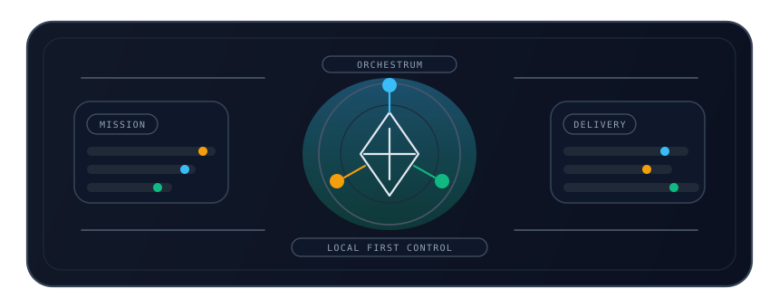
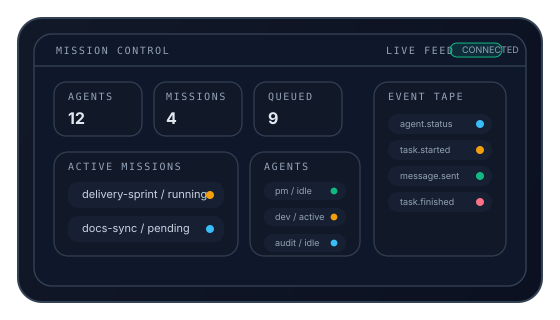
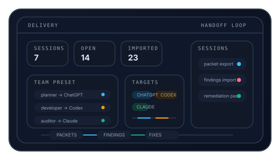
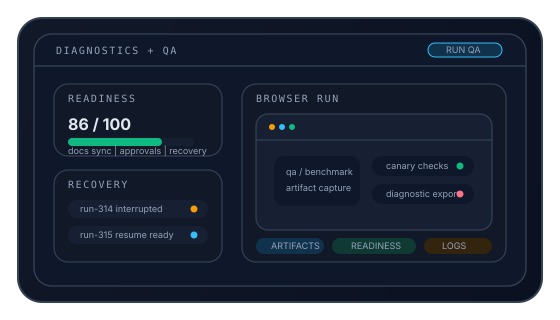
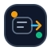
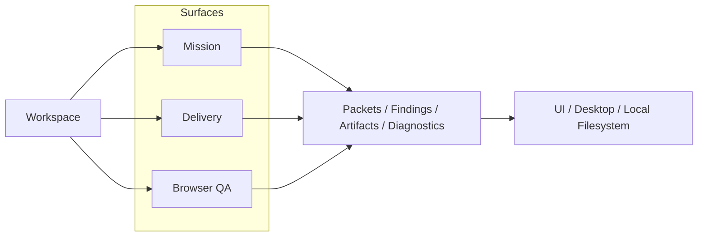
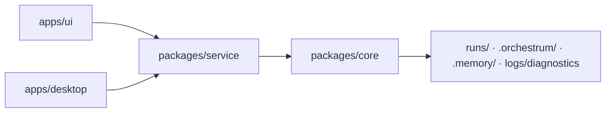

<!--
README COVER CONTRACT
This README is the public cover and landing page for Orchestrum.
Do not flatten it into plain documentation or replace its visual hierarchy with a bare outline.
Preserve the cover-quality composition: hero, iconography, showcase panels, Mermaid diagrams, card/table sections, and footer unless a user explicitly asks for a redesign.
Update claims for accuracy, but keep the presentation structure and narrative flow intact.
-->
<div align="center">

<br/>



<p>
  
</p>

# Orchestrum

### **The Local-First AI Engineering Control Plane**

*Mission orchestration, delivery handoff, and browser QA for teams that want AI leverage without surrendering the repo.*

[](docs/ARCHITECTURE.md)
[](LICENSE)
[](package.json)
[](apps/desktop/package.json)

<sub>TypeScript strict | Next.js UI | local service | plugin hooks | filesystem-backed runs</sub>

<p>
  <a href="#showcase">Showcase</a> |
  <a href="#product-surface">Product Surface</a> |
  <a href="#how-it-moves">How It Moves</a> |
  <a href="#how-its-built">How It's Built</a> |
  <a href="#getting-started">Getting Started</a> |
  <a href="#appendix">Appendix</a>
</p>

</div>

> **Orchestrum is not a SaaS.** It runs on your machine, keeps packets, findings, diagnostics, and run artifacts local, and gives AI-assisted engineering a deliberate operator workflow.

## Showcase

*Three illustrated panels, drawn from the product's actual interface language rather than stock README chrome.*

<table>
<tr>
<td width="33%" valign="top" align="center">



<p><strong>Mission Control</strong></p>
<sub>Live feed, queue pressure, active missions, and an event tape that feels operational.</sub>

</td>
<td width="33%" valign="top" align="center">



<p><strong>Delivery Loop</strong></p>
<sub>Packet export, tool-aware handoff, findings, and remediation flow in one local session.</sub>

</td>
<td width="33%" valign="top" align="center">



<p><strong>Browser QA + Diagnostics</strong></p>
<sub>Readiness, recovery, QA runs, and evidence surfaces that keep the system explainable.</sub>

</td>
</tr>
</table>

<p align="center">
  
</p>

## Product Surface

*The public story stays tight, even though the platform has more supporting faces behind it.*

<table>
<tr>
<td width="33%" valign="top" align="center">


<p><strong><code>mission</code></strong></p>

<p>Built-in execution graphs for autonomous or semi-autonomous engineering work.</p>

<p><code>orchestrum mission start --template feature-dev ...</code></p>

</td>
<td width="33%" valign="top" align="center">



<p><strong><code>delivery</code></strong></p>

<p>Work-packet export/import, findings, remediations, and evidence tracking in one local session.</p>

<p><code>orchestrum delivery run --repo /path/to/repo ...</code></p>

</td>
<td width="33%" valign="top" align="center">


<p><strong><code>browser qa</code></strong></p>

<p>Local <code>qa</code>, <code>benchmark</code>, and <code>canary</code> runs against a live application.</p>

<p><code>orchestrum qa --base-url http://localhost:3000 ...</code></p>

</td>
</tr>
</table>

Supporting pages such as Mission Control, Diagnostics, Templates, Runs, and Workspaces reinforce that core loop without replacing it.

Legacy YAML workflow execution has been removed from the project.

## Features

*Enough structure to feel operator-grade, enough restraint to stay legible from the repo front page.*

<table>
<tr>
<td width="50%" valign="top">


<strong>Built-in Missions</strong>
<ul>
  <li>Start from built-in mission templates instead of wiring raw workflows.</li>
  <li>Track node artifacts, events, and run logs on the local filesystem.</li>
  <li>Pause for external handoff and continue with mission import flows.</li>
</ul>

</td>
<td width="50%" valign="top">


<strong>Delivery Handoff</strong>
<ul>
  <li>Generate packets from repo context and team preset data.</li>
  <li>Export for ChatGPT, Cursor, Codex, Copilot, and Claude.</li>
  <li>Import responses back into findings, remediations, evidence, and summaries.</li>
</ul>

</td>
</tr>
<tr>
<td width="50%" valign="top">


<strong>Browser QA and Diagnostics</strong>
<ul>
  <li>Run <code>qa</code>, <code>benchmark</code>, and <code>canary</code> sessions against a local base URL.</li>
  <li>Capture browser artifacts, readiness signals, and diagnostics in the same control plane.</li>
  <li>Keep QA evidence alongside mission and delivery data.</li>
</ul>

</td>
<td width="50%" valign="top">


<strong>Local Platform</strong>
<ul>
  <li>Operate through the CLI, the Next.js UI, or the Electron desktop shell.</li>
  <li>Use the local service for API access, indexing, recovery, and SSE streaming.</li>
  <li>Install local plugins and keep workspace state under <code>.orchestrum/</code> and <code>.memory/</code>.</li>
</ul>

</td>
</tr>
</table>

## How It Moves

*One workspace fans out into three surfaces, then collapses back into one local evidence trail.*



## How It's Built

*The topology is intentionally plain: operator surfaces, one service, one core, and local persistence.*



<details>
<summary><strong>Typical run layout</strong></summary>

```text
runs/<workspaceId>/<runId>/
  run.json
  events.ndjson
  logs/
  steps/
  nodes/
  delivery/
```

</details>

<p align="center">
  
</p>

## Getting Started

*Fast enough to try in minutes, explicit enough to understand what is happening.*

### Prerequisites

| Requirement | Version |
| --- | --- |
| **Node.js** | 18+ |
| **npm** | 9+ |
| **Git** | Any recent version |

### Install and Launch

```bash
git clone https://github.com/mrtergn/orchestrum.git
cd orchestrum
npm run bootstrap
npm run ui
```

Open [http://localhost:3000](http://localhost:3000).

### First Session

1. Add a workspace from the UI or with `orchestrum workspace add /path/to/repo`.
2. Configure provider secrets such as `OPENAI_API_KEY` or `ANTHROPIC_API_KEY`.
3. Start a mission from the built-in templates or create a delivery session for the target repo.
4. Review packets, imports, findings, remediations, artifacts, and diagnostics from the run views.

<details>
<summary><strong>Other local entry points</strong></summary>

```bash
npm run service
npm run dev
npm run desktop
npm run build:desktop
npm run dist:desktop
```

</details>

## Appendix

### CLI Snapshot

<details>
<summary><strong>Mission, delivery, and browser QA</strong></summary>

```bash
orchestrum mission start --template feature-dev --workspace demo --goal "Ship the feature"
orchestrum mission import --run mission-123 --node implement --workspace demo --file response.md
orchestrum cancel mission-123 --workspace demo

orchestrum delivery doctor --repo /path/to/repo --workspace demo
orchestrum delivery init-preset --repo /path/to/repo --workspace demo
orchestrum delivery run --repo /path/to/repo --workspace demo --goal "Sprint 12"
orchestrum delivery export packet-1 --run delivery-123 --workspace demo --target chatgpt
orchestrum delivery import --run delivery-123 --workspace demo --target chatgpt --file response.txt
orchestrum delivery findings --run delivery-123 --workspace demo
orchestrum delivery summary --workspace demo

orchestrum qa --repo /path/to/repo --workspace demo --base-url http://localhost:3000
orchestrum benchmark --repo /path/to/repo --workspace demo --base-url http://localhost:3000
orchestrum canary --repo /path/to/repo --workspace demo --base-url http://localhost:3000
```

</details>

<details>
<summary><strong>Workspace, diagnostics, and maintenance</strong></summary>

```bash
orchestrum ui
orchestrum workspace add /path/to/repo
orchestrum workspace list

orchestrum doctor --workspace demo
orchestrum diagnostics export --workspace demo --run mission-123
orchestrum backup create
orchestrum backup restore ./backups/backup-123.tar.gz --into /tmp/orchestrum-restore
orchestrum docs sync --repo /path/to/repo
```

</details>

### Docs

| Document | What it covers |
| --- | --- |
| [CLI](docs/CLI.md) | Commands for mission, delivery, browser QA, secrets, backups, and updates |
| [Architecture](docs/ARCHITECTURE.md) | System layers, data flow, storage model, and recovery |
| [Examples](docs/EXAMPLES.md) | Concrete mission, delivery, QA, and diagnostics usage |
| [Troubleshooting](docs/TROUBLESHOOTING.md) | Common startup, import, approval, patch, and stream issues |
| [OSS Parity](docs/OSS_PARITY.md) | What the open-source build exposes today |
| [Plugins](docs/PLUGINS.md) | Local plugin model, manifests, and lifecycle hooks |

### Contributing

Orchestrum welcomes focused improvements that strengthen the local-first operator experience.

- [CONTRIBUTING.md](CONTRIBUTING.md)
- [CODE_OF_CONDUCT.md](CODE_OF_CONDUCT.md)
- [SECURITY.md](SECURITY.md)

<details>
<summary><strong>Local verification commands</strong></summary>

```bash
npm run test
npm run typecheck
npm run lint
npm run build:desktop
```

</details>

## License

Orchestrum is available under the [MIT License](LICENSE).

<div align="center">


<p>
  
</p>

**Built with love for developers who want AI workflows that stay close to their code.**

*Your repo, packets, findings, and artifacts stay on your machine.*

<sub>If Orchestrum helps your workflow, consider giving it a star.</sub>

</div>
